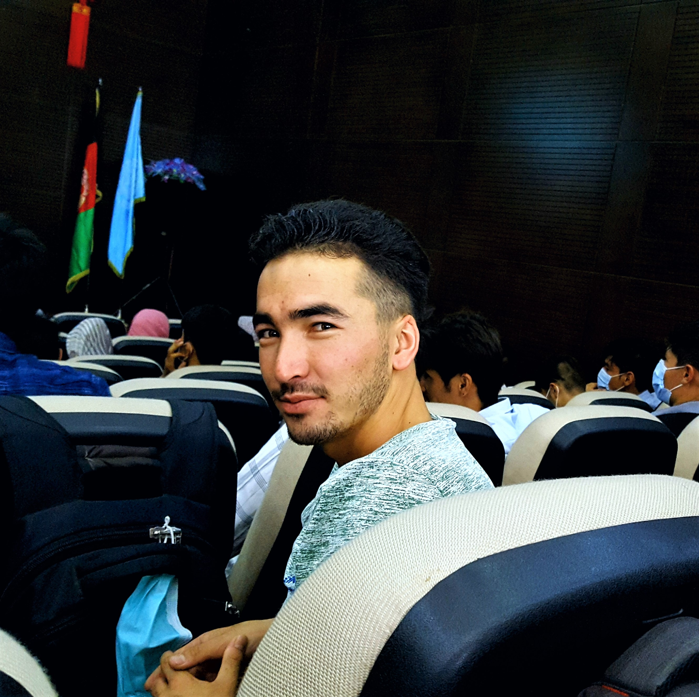

# **_Kazim Kayhan_**

Software engineer & Php developer.

---

⚡ Software engineering is my main major in Kabul University, faculty of computer science, and now I'm a junior software engineer there. In addition to my main major, I love web design and development. My web development journey begun about two years ago(late 2019). Right now I am using laravel php's framework for backend development, but I use vue.js and tailwind css or bootstrap for front-end development. I have done so many small and medium projects with Laravel, Php, Vue.js, Tailwind css, Html, css, Bootstrap and vanilla JavaScript.  I have worked with MySQL and PostgreSQL DBMSes.

🌱 I intend to learn Nuxt.js and mobile app development with Laravel.

---

### 📫 Contact me

* My [linkedin profile](linkedin.com/in/kazim-kayhan)
* My [personal portfolio](kazim-mohammadi.netlify.app)
* My [twitter account](https://twitter.com/Kazim2kayhan)
* My [telegram messenger](https://t.me/Kazim_Kayhan)
* Email : <a href="mailto:mail4kazim.kayhan@gmail.com">mail4kazim.kayhan@gmail.com</a>

<!--
**Kazim-Mohammadi/Kazim-Mohammadi** is a ✨ _special_ ✨ repository because its `README.md` (this file) appears on your GitHub profile.

Here are some ideas to get you started:

- 🌱 I’m currently learning ...
- 👯 I’m looking to collaborate on ...
- 🤔 I’m looking for help with ...
- 💬 Ask me about ...
- 📫 How to reach me: ...
- 😄 Pronouns: ...
- ⚡ Fun fact: ...
-->
